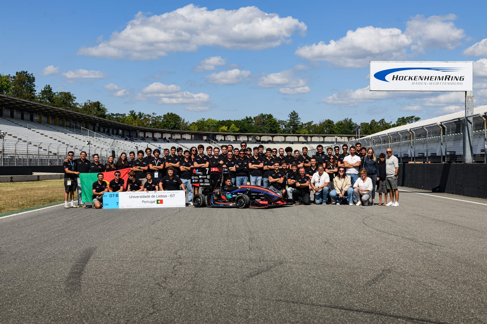
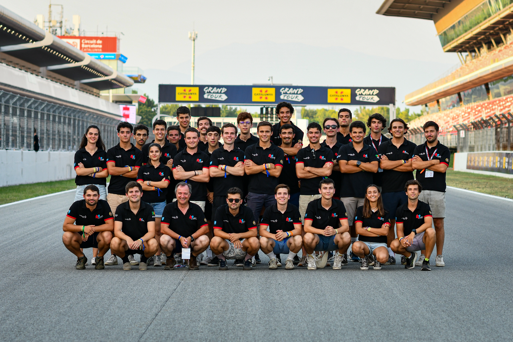
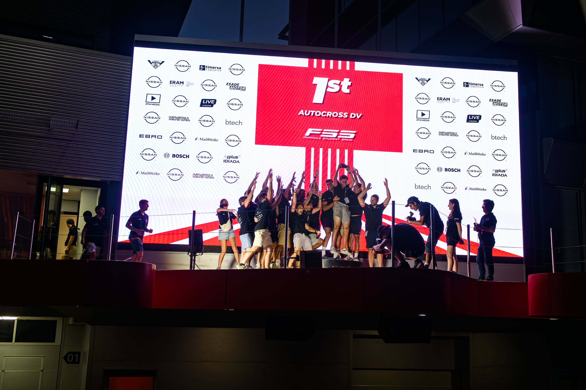
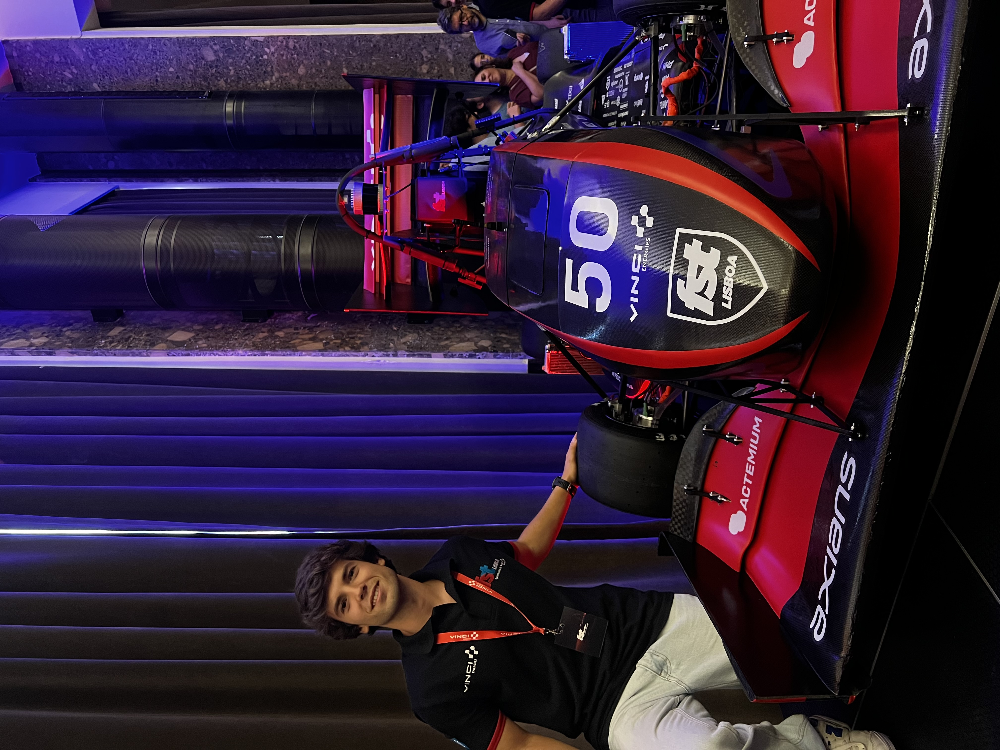
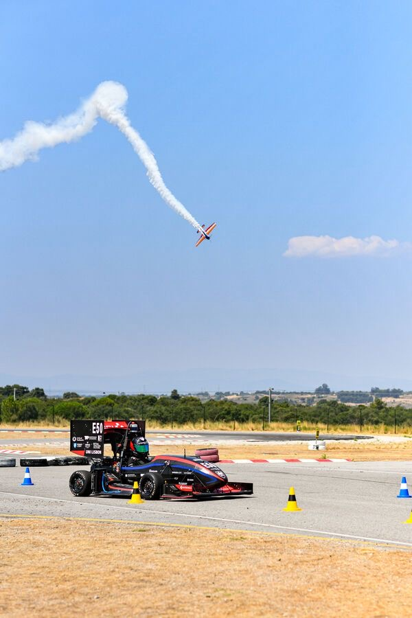

### FST Lisboa Autonomous Race Car

🏎️ FST Lisboa (https://www.fstlisboa.com/) is the Formula Student team from Instituto Superior Técnico that competes in the largest engineering competition in the world. Every year the team designs and builds a completely new race car to compete against top universities worldwide. The car competes in both driver controlled and fully autonomous events.

🤖 I was part of the Autonomous Systems team for 2 years where we developed full self driving racing capabilities. In the autonomous competition the car must race on completely unknown tracks, perform maximum straight line accelerations and complete figure 8 steering tests. The most important dynamic event is Trackdrive where the car must complete 10 consecutive laps on an unseen track fully autonomously.

🎥 Here is a demonstration video of the car driving autonomously on an unknown track:

🧱 The high level architecture of the autonomous pipeline is shown below:

## My Contributions

📦 During my two years in the Autonomous Systems team I contributed to several core modules of the full autonomous driving pipeline. My work covered three main areas: perception, estimation and SLAM, and control planning.

🔍 Perception module contributions: [PERCEPTION.md](PERCEPTION.md)

🧠 Estimation and SLAM module contributions: [ESTIMATION_SLAM.md](ESTIMATION_SLAM.md)

🏁 Control planning module contributions: [CONTROL.md](CONTROL.md)

## Photo Gallery

<table>
  <tr>
    <td></td>
    <td></td>
    <td></td>
  </tr>
  <tr>
    <td></td>
    <td></td>
  </tr>
  <tr>
    <td></td>
    <td></td>
  </tr>
</table>
